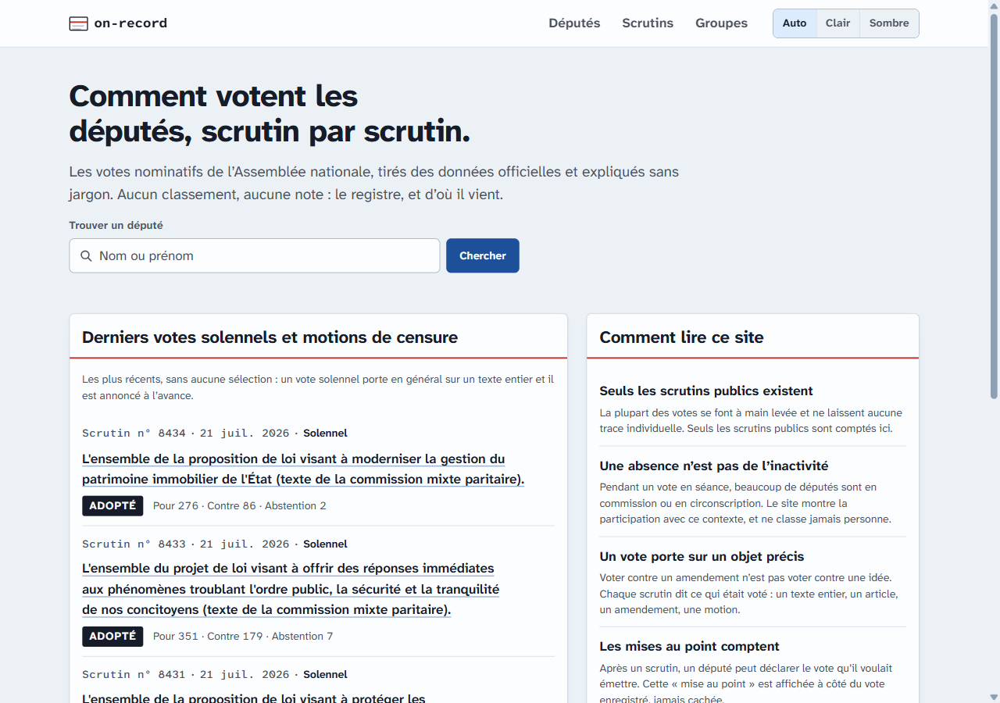

# on-record

What French elected officials actually do, on the record — not what they say.

The first source is the Assemblée nationale: every public vote of every deputy,
with the group they sat in on that day, explained in plain French for readers
with no parliamentary knowledge. No ranking, no score: every figure links to
the votes it counts, and every page cites its official source. The project is
built to take more sources without changing its shape: the Senate's votes and
the declarations of interests published by the HATVP have joined it.

Live: <https://on-record-203.pages.dev>

| Home | A deputy (dark theme) |
| --- | --- |
|  |  |

| A scrutin | On a phone | |
| --- | --- | --- |
|  |  |  |

## How it works

There is no server. A nightly job downloads the Assemblée's open data files,
checks them and writes small JSON datasets; the site is static files on
Cloudflare Pages that read those datasets. Every deputy page, every solemn
vote and motion of censure, and the list pages are prerendered to HTML at
build time and hydrated in the browser, so search engines and link previews
read the real content; the thousands of ordinary scrutins are rendered in the
browser.

- `apps/ingest` — downloads and normalises the open data into `.data/`
- `apps/web` — the site: Vite, React, React Router, react-aria-components,
  Sass; prerendered with `react-dom/static`
- `packages/protocol` — the dataset schemas (Zod) both sides share

## Run it

Node 26+ and pnpm (through Corepack).

```sh
pnpm install
pnpm ingest   # downloads the open data and writes .data/ (cached afterwards)
pnpm dev      # http://localhost:5480
```

`pnpm build` builds every package; the site lands in `apps/web/dist`, data
and prerendered pages included. `pnpm test` and `pnpm lint:ci` are what CI
runs.

## Docs

- Product intent and editorial principles: [`docs/product.md`](docs/product.md)
- Data sources and their pitfalls: [`docs/data-sources.md`](docs/data-sources.md)
- Architecture and hosting: [`docs/architecture.md`](docs/architecture.md)
- Build plan: [`docs/plans/README.md`](docs/plans/README.md)

## Licences

Code: AGPL-3.0-or-later ([`LICENSE`](LICENSE)).

Data: Assemblée nationale open data, published under the
[Licence Ouverte / Open Licence](https://www.etalab.gouv.fr/licence-ouverte-open-licence/)
(Etalab). The site cites the source on every page.
